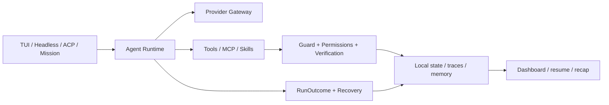

# Qling (轻灵)

[](#install)
[](https://github.com/Zzy-min/qling/releases/latest)
[](https://www.npmjs.com/package/@qlingzzy/qling)
[](LICENSE)

[中文说明](README.md) · [Install guide](docs/install.md) · [60-second demo](docs/demo.md) · [CHANGELOG](CHANGELOG.md)

**A local-first AI Agent CLI workbench designed for Chinese developers and inspectable terminal workflows.**

Qling brings chat, tool execution, permissions, memory, recovery, background work, and runtime evidence into one terminal control surface. It does not treat “the model said it is done” as success: every run has an explicit outcome, tool calls have a timeline, failures can pause with context intact, and long-running missions can survive the terminal session.

> Runtime state and diagnostics stay local by default. Model requests go only to the Provider you configure; with Ollama, the model can stay local too.

[Download the latest release](https://github.com/Zzy-min/qling/releases/latest) · [Install](docs/install.md) · [Report an issue](https://github.com/Zzy-min/qling/issues)

## Why Qling

| Principle | What Qling does | Inspect it with |
|---|---|---|
| **Local-first, with an explicit network boundary** | Sessions, checkpoints, memory, missions, traces, and diagnostics default to `~/.qling/`; remote Provider boundaries remain visible. | `qling privacy`, `qling storage`, `qling doctor` |
| **Truthful outcomes** | Runs end as `succeeded`, `paused`, `exhausted`, `failed`, or `canceled`; unfinished work is never reported as success. | `qling run ... --json`, Dashboard |
| **An evidence chain** | Tool start/end events, failure categories, recovery actions, usage sources, and run state are structured and locally inspectable. | `/trace`, `/usage`, `qling dashboard start` |
| **Recovery by design** | Checkpoints, session resume, workflow resume, and Missions preserve the run context needed to continue. | `/checkpoint`, `/resume`, `qling mission` |
| **Terminal-native UX** | Slash discovery, completion, multiline editing, history search, managed scrollback, and Chinese aliases. | `qling`, `/help`, `qling shortcuts` |
| **Explainable safety** | Permission rules, guards, write sandboxing, secret redaction, and daemon authentication are visible controls. | `/permissions explain`, `/config`, `/hooks` |
| **Controlled extensibility** | Local Markdown skills, MCP, lifecycle Hooks, signed-manifest plugins, ACP, and a Node SDK. | `/skill`, `qling mcp`, `qling acp` |

## Runtime shape



The same runtime serves the interactive TUI, versioned NDJSON, editor ACP, and background Missions. Provider, MCP registry, Memory, and the tool dispatcher are scoped to each Agent; critical JSON state uses serialized atomic writes and backup recovery.

## Install

### Windows portable release

Download `qling-win-x64.zip` from [GitHub Releases](https://github.com/Zzy-min/qling/releases/latest), extract it, then run:

```powershell
.\qling-win-x64\qling.exe --version
.\qling-win-x64\qling.exe doctor
.\qling-win-x64\qling.exe setup
```

The archive embeds Node.js. It does not require a system Node installation.

### npm

```bash
npm install -g @qlingzzy/qling --registry https://registry.npmjs.org/
qling --version
qling bootstrap
```

GitHub Releases and npm may publish on different schedules. Check the release page and `npm view @qlingzzy/qling version` when an exact version matters.

### Source

Requires Node.js 18+ and npm 9+:

```bash
git clone https://github.com/Zzy-min/qling.git
cd qling
npm run bootstrap
npm link
```

Optional browser support:

```bash
npm run bootstrap -- --with-browser
```

`bootstrap` checks the local environment, installs dependencies, builds Qling, initializes its state directory, and points to `doctor` / `setup`. It does not silently enable the Dashboard, semantic memory, or dynamic discovery.

## Configure a model

```bash
qling setup
```

`setup` stores non-secret Provider, model, and endpoint settings. It does not write the API key into `.env`. Prefer an OS user environment variable:

```powershell
[Environment]::SetEnvironmentVariable('QLING_LLM_API_KEY', '<your-key>', 'User')
```

Then open a new terminal:

```bash
qling doctor
qling run "analyze this repository and identify three high-impact issues"
```

Qling supports OpenAI-compatible endpoints. After starting Ollama, choose the local preset with `/model use ollama`.

## 60-second path

```bash
qling doctor
qling
```

Inside the TUI:

```text
/help
/plan on
Analyze this repository. Plan first, then run checks.
/trace
/usage
```

This demonstrates local diagnostics, visible slash commands, a tool timeline, structured failure/recovery context, and usage completeness. For a background task:

```bash
qling daemon start
qling mission start "review this repository and prepare a report"
qling dashboard start
```

See [docs/demo.md](docs/demo.md) for the recording checklist.

## Truthful execution semantics

| Outcome | Meaning | Headless exit code |
|---|---|---:|
| `succeeded` | The task completed with final text | `0` |
| `paused` | Failure context was preserved for recovery or a human decision | `2` |
| `exhausted` | The iteration limit was reached before completion | `2` |
| `failed` | The run ended with a structured failure | `1` |
| `canceled` | The user or host canceled the run | `130` |

Use versioned NDJSON in scripts and CI:

```bash
qling run "inspect the project" --json
```

The stream includes `schemaVersion: 1`, execution events, the final `outcome`, and usage. When Provider usage, model pricing, or subagent usage is incomplete, Qling marks `costIsPartial` / `usageIsIncomplete` instead of displaying an estimate as an exact bill.

## TUI and recovery

Press `/` to open command candidates. Type a prefix and press `Tab` to complete without executing it. Common controls:

```text
/checkpoint before-refactor
/sessions
/resume latest
/recover status
/trace
/verify
/privacy
/permissions explain bash
/skill list
/memory status
```

`Shift+Tab` cycles normal → plan → auto(Always-approve) while preserving the current draft. Run `qling shortcuts` or `/shortcuts` for the current complete key map.

Experimental token streaming is off by default and only affects interactive chat when enabled:

```yaml
experimental:
  streaming_chat: true
```

Headless, Mission, and ACP keep complete responses by default. Unsupported streaming falls back once without duplicating the request.

## Missions and local Dashboard

```bash
qling daemon start
qling mission start "complete the repository review"
qling mission list
qling mission attach <id>
qling dashboard start
```

Missions support pause, resume, cancel, retry, and read-only attach. A paused Mission saves the session, message context, and `runId` so the daemon can continue from persisted run state.

The daemon listens on `127.0.0.1` by default and creates a local bearer token. Non-loopback binding requires explicit remote permission and authentication cannot be disabled remotely.

## Skills, MCP, and integrations

Skills are loaded progressively from workspace, user, and bundled directories. Reference examples such as `repo-triage`, `fix-failing-test`, `add-function`, and `pr-summary` live under `skills/examples/`; copy one into a workspace or user skill directory before using it.

```text
/skill list
/skill search test
/fix-failing-test
```

See [docs/skills.md](docs/skills.md) for precedence and compatibility directories.

MCP supports stdio and HTTP transports. Eager exposure remains the compatibility default; optional `search_tool` / `use_tool` catalog mode reduces the initial tool schema. UTF-8 output limits carry truncation metadata, and HTTP errors are rejected instead of being delivered as normal MCP messages.

Other surfaces:

- `qling acp`: ACP v1 NDJSON stdio for editor integration.
- `@qlingzzy/qling` SDK: AgentLoop, `RunOutcome`, Provider errors, config, presets, and tool dispatch; see [docs/sdk.md](docs/sdk.md).
- JSON lifecycle Hooks: `SessionStart/End`, `PreToolUse`, `PostToolUse`, and `PostToolUseFailure`.
- Local plugins: signed manifests by default, with an explicit reviewed-local override for unsigned sources.
- Channels: console, Telegram, and Slack.

## Local data and security

Qling stores runtime state under `~/.qling/` by default; `--file-state-dir` overrides it. Typical data includes sessions, checkpoints, exports, memory/WAL, missions, workflows, goals, local tasks, redacted run traces, audit artifacts, daemon credentials, and plugin/channel state.

```bash
qling privacy
qling storage
qling config
qling permissions
qling doctor
```

Security defaults:

- API keys are excluded from prompts, traces, logs, and displayed error bodies.
- Write tools are governed by workspace sandboxing, permission policy, and guards.
- Daemon routes use loopback binding, bearer auth, and a 1 MiB default request limit.
- OTEL is off by default and, when doubly enabled, exports metadata only—not conversation content.
- Corrupted memory/state prefers backup recovery and read-only degradation over destructive empty writes.

## Development and quality gates

```bash
npm install
npm run build
npm test
npm run test:smoke
npm run ci:check
```

Focused local evaluations:

```bash
npm run eval:smoke
npm run eval:recovery
npm run eval:tasks
npm run eval:anchored
npm run validate:packaging
npm run dep:layers -- --strict
```

`ci:check` covers build, unit tests, smoke tests, core evaluations, packaging declarations, and strict dependency layers.

## Distribution status

Verified on 2026-07-22; channel pages remain the source of truth after that date.

| Channel | Verified state |
|---|---|
| Source / GitHub Release | `v1.3.1`; Windows portable ZIP is published |
| npm `@qlingzzy/qling` | `1.3.0` |
| Public `Zzy-min/scoop-qling` bucket | `1.2.2`; not the latest release |
| Scoop Extras | PR #18307 closed without merge; use source/npm/portable ZIP until the bucket is resynced |
| WinGet | PR #402294 is open on manifest `1.3.1`; external validation/review is not yet complete |

Do not infer that every channel carries the same version. See [docs/install.md](docs/install.md) for current choices.

## Current boundaries

- Model tasks require a configured OpenAI-compatible Provider or a running local Ollama instance.
- Token streaming, browser act, LSP, anchored edit, dynamic discovery, and parts of JSON lifecycle Hooks remain explicit opt-ins.
- Dashboard and daemon are local control surfaces; do not expose them directly to the public internet.
- `browser_fetch` requires Playwright Chromium.

## Documentation

- [Installation and removal](docs/install.md)
- [60-second demo](docs/demo.md)
- [SDK](docs/sdk.md)
- [Skills](docs/skills.md)
- [Docker](docs/docker.md)
- [Web/browser routing](docs/web-routing.md)
- [OTEL metadata boundary](docs/otel.md)
- [Architecture layers](docs/architecture-layers.md)
- [Changelog](CHANGELOG.md)

## Design principles

- **Local-first** — important runtime state stays inspectable on the machine by default.
- **Evidence over optimism** — tool timelines, verification, and structured outcomes beat model self-reporting.
- **Recoverable by design** — interruption and failure must have a continuation path.
- **Honest boundaries** — unsupported, unconfigured, and incomplete states stay explicit.
- **Terminal-native** — rich TUI plus plain text, Headless, and protocol surfaces.

## License

[MIT](LICENSE)
