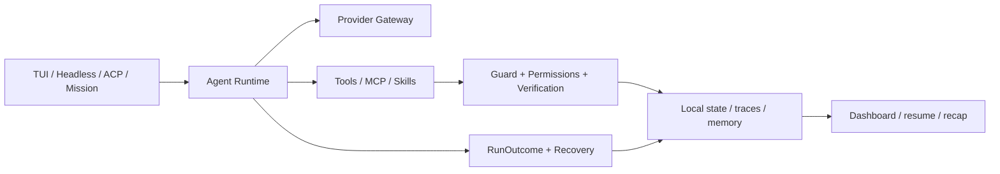

# 轻灵 Qling

[](#安装)
[](https://github.com/Zzy-min/qling/releases/latest)
[](https://www.npmjs.com/package/@qlingzzy/qling)
[](LICENSE)

[English](README.en.md) · [安装指南](docs/install.md) · [60 秒演示](docs/demo.md) · [CHANGELOG](CHANGELOG.md)

**面向中文开发者的本地优先 AI Agent CLI 工作台。**

轻灵把聊天、工具执行、权限、记忆、恢复、后台任务和运行证据收进一个终端控制面。它不把“模型说完成了”当作完成：每次运行都有明确终态，工具调用有时间线，失败可以暂停并保留上下文，长任务可以在终端关闭后继续。

> 状态和诊断默认留在本机；模型请求只发送给你明确配置的 Provider。使用 Ollama 时，模型也可以运行在本机。

[下载最新 Release](https://github.com/Zzy-min/qling/releases/latest) · [查看安装方式](docs/install.md) · [提交问题](https://github.com/Zzy-min/qling/issues)

## 为什么是轻灵

多数 Agent CLI 解决的是“让模型调用工具”。轻灵更关注工具调用之后的问题：状态保存在哪里、失败是否被如实呈现、终端断开后任务怎么办、成本信息是否完整，以及你能否看见一条可复查的证据链。

| 特点 | 轻灵如何实现 | 入口 |
|---|---|---|
| **本地优先，而非本地幻觉** | 会话、checkpoint、记忆、任务、运行 trace 和诊断默认写入 `~/.qling/`；远程 Provider 边界会明确展示。 | `qling privacy`、`qling storage`、`qling doctor` |
| **终态可信** | 运行只会进入 `succeeded`、`paused`、`exhausted`、`failed` 或 `canceled`；未完成任务不会伪装成成功。 | `qling run ... --json`、Dashboard |
| **证据链可见** | 工具开始/结束、失败分类、恢复动作、用量来源和运行状态进入结构化事件与本地 trace。 | `/trace`、`/usage`、`qling dashboard start` |
| **中断后可继续** | checkpoint、session resume、workflow resume 和 Mission 保存运行身份与恢复上下文。 | `/checkpoint`、`/resume`、`qling mission` |
| **中文终端原生** | 中文帮助与别名、slash 命令面板、补全、多行编辑、历史搜索和 managed scrollback。 | `qling`、`/help`、`qling 快捷键` |
| **安全边界可解释** | 权限策略、guard、写入沙箱、密钥脱敏和本地 Daemon 鉴权不是隐藏开关。 | `/permissions explain`、`/config`、`/hooks` |
| **扩展但不失控** | 支持本地 Markdown skills、MCP、生命周期 Hooks、签名清单插件、ACP 和 SDK。 | `/skill`、`qling mcp`、`qling acp` |

## 它是怎样工作的



同一套运行内核服务于交互 TUI、脚本化 NDJSON、编辑器 ACP 和后台 Mission。Provider、MCP registry、Memory 与工具 dispatcher 绑定到当前 Agent，避免并发 Agent 之间串线；关键 JSON 状态采用原子写入与备份恢复。

## 安装

### Windows 便携包

从 [GitHub Releases](https://github.com/Zzy-min/qling/releases/latest) 下载 `qling-win-x64.zip`，解压后运行：

```powershell
.\qling-win-x64\qling.exe --version
.\qling-win-x64\qling.exe doctor
.\qling-win-x64\qling.exe setup
```

便携包内嵌 Node.js，不要求系统预装 Node。Scoop、自建 bucket、WinGet 进度和卸载说明见 [安装指南](docs/install.md)。

### npm

```bash
npm install -g @qlingzzy/qling --registry https://registry.npmjs.org/
qling --version
qling bootstrap
```

GitHub Release 与 npm 可能按不同节奏发布；可分别查看 Releases 和 `npm view @qlingzzy/qling version` 确认版本。

### 从源码启动

要求 Node.js 18+、npm 9+：

```bash
git clone https://github.com/Zzy-min/qling.git
cd qling
npm run bootstrap
npm link
```

需要 Playwright 浏览器抓取时：

```bash
npm run bootstrap -- --with-browser
```

`bootstrap` 会检查环境、安装依赖、构建项目、初始化本地目录并给出 `doctor` / `setup` 下一步；不会自动开启 Dashboard、语义记忆或动态发现。

## 配置模型

最快方式：

```bash
qling setup
```

`setup` 保存 Provider、Model、Endpoint 等非敏感配置，不把 API key 写入 `.env`。推荐将密钥放入系统用户环境变量：

```powershell
[Environment]::SetEnvironmentVariable('QLING_LLM_API_KEY', '<your-key>', 'User')
```

新开终端后运行：

```bash
qling doctor
qling run "分析当前仓库并列出三个最值得修复的问题"
```

轻灵支持 OpenAI 兼容 Provider，也可以在安装并启动 Ollama 后使用本地模型：

```text
/model use ollama
```

## 60 秒体验路径

```bash
qling doctor
qling
```

进入 TUI 后：

```text
/help
/plan on
分析这个仓库，先给计划，再执行检查
/trace
/usage
```

你会看到：

1. `doctor` 只读取本机状态与 loopback 服务，不调用模型。
2. `/` 打开可见的命令面板，命令不会藏在提示词后面。
3. 工具执行形成时间线，而不是只返回一句“已完成”。
4. 受控失败进入恢复或暂停状态，并保留失败上下文。
5. `qling mission start` 可以把长任务交给本地 Daemon，终端关闭后继续运行。

完整录制脚本见 [docs/demo.md](docs/demo.md)。

## 可信执行与恢复

轻灵公开区分五种运行结果：

| Outcome | 含义 | Headless 退出码 |
|---|---|---:|
| `succeeded` | 任务完成并产生最终文本 | `0` |
| `paused` | 工作流保留失败上下文，等待恢复或人工决策 | `2` |
| `exhausted` | 达到迭代上限，任务仍未完成 | `2` |
| `failed` | 结构化终止失败 | `1` |
| `canceled` | 用户或上层运行时取消 | `130` |

脚本和 CI 可以读取版本化 NDJSON：

```bash
qling run "检查项目并输出结论" --json
```

输出包含 `schemaVersion: 1`、执行事件、最终 `outcome` 和 usage。若 Provider 用量、价格或子代理 usage 不完整，轻灵会标记 `costIsPartial` / `usageIsIncomplete`，不会把估算值伪装成精确账单。

恢复入口：

```text
/checkpoint before-refactor
/sessions
/resume latest
/recover status
/rewind
```

```bash
qling --continue
qling --resume <session-id>
qling workflow resume <workflow-id>
```

重复动作只产生一次 `loop_detected` 停止信号；压缩失败会保留原历史并发出 `compaction_failed`，避免自动重试循环。

## TUI：命令可发现，草稿不易丢

`qling` 默认进入 TUI。按 `/` 打开命令候选，输入前缀过滤，`Tab` 补全但不自动执行。状态线显示模型、session、分支、权限模式、目标、后台任务和用量状态。

常用 slash 命令：

| 类别 | 命令 |
|---|---|
| 会话 | `/checkpoint`、`/sessions`、`/resume`、`/rewind`、`/export` |
| 执行 | `/plan`、`/goal`、`/verify`、`/recover`、`/trace`、`/diff` |
| 上下文 | `/context`、`/usage`、`/compact`、`/repomap` |
| 本地知识 | `/skill`、`/memory`、`/dream`、`/distill`、`/knowledge` |
| 安全诊断 | `/privacy`、`/permissions`、`/doctor`、`/config`、`/mcp`、`/hooks` |
| 后台任务 | `/mission`、`/agents`、`/tasks`、`/queue` |

<details>
<summary>查看与代码保持同步的 TUI 快捷键</summary>

| Key | Behavior |
|---|---|
| `Enter` | 发送当前输入。 |
| `Tab` | 空输入且有轮次时进入 managed scrollback；无轮次时打开 `/agents`；slash 前缀补全；其他草稿保留并提示。 |
| `Shift+Tab` | 循环 normal → plan → auto(Always-approve) → normal，并保留草稿。 |
| `Ctrl+N` | 插入换行，继续编辑多行 prompt。 |
| `Ctrl+R` | 搜索本会话内输入历史，未命中时保留草稿。 |
| `Ctrl+A / Ctrl+E` | 移动到输入开头 / 结尾。 |
| `Ctrl+U / Ctrl+K` | 删除光标前 / 后的输入内容。 |
| `Ctrl+L` | 清空当前终端视图并重绘输入栏，不丢弃正在编辑的内容。 |
| `Ctrl+C` | 非空输入时清空；空输入时再次 Ctrl+C 确认退出。 |
| `Ctrl+Z` | 恢复最近一次被 Ctrl+C 清空的本地草稿。 |
| `Ctrl+D` | 空输入时退出；非空输入时保留草稿并提示。 |
| `Esc` | 关闭浮层并恢复焦点与草稿；不提交输入。 |
| `↑ / ↓` | 浮层中导航；输入区切换历史并恢复未发送草稿。 |
| `Ctrl+O` | 切换后续长工具输出的展开 / 折叠显示。 |
| `Ctrl+\` | 打开 / 关闭会话切换器。 |
| `PgUp / PgDn` | 在 managed scrollback 当前轮内翻页。 |

完整列表以 `qling shortcuts` 或 `/shortcuts` 为准。

</details>

实验性 token streaming 默认关闭。只为交互 TUI 开启：

```yaml
experimental:
  streaming_chat: true
```

也可设置 `QLING_EXPERIMENTAL_STREAMING_CHAT=true`。Headless、Mission 和 ACP 默认继续使用完整响应；不支持流式的 Provider 会单次回退，不重复请求。

## 长任务与本地 Dashboard

```bash
qling daemon start
qling mission start "完成仓库审查并生成报告"
qling mission list
qling mission attach <id>
qling dashboard start
```

Mission 支持 `pause`、`resume`、`cancel`、`retry` 和只读 `attach`。暂停状态会保存 session、消息上下文和 `runId`；Daemon 重启后可以从已保存的运行状态继续。

Daemon 默认只监听 `127.0.0.1`，自动生成本地 bearer token。非 loopback 监听必须同时显式允许远程绑定并保持鉴权开启。

## Skills、MCP 与集成

### 本地 Skills

Markdown skill 可以放在内置、用户或工作区目录，通过以下方式发现和读取：

```text
/skill list
/skill search test
/skill fix-failing-test
/fix-failing-test
```

内置 slash 命令优先于同名 skill，避免扩展覆盖核心控制面。说明见 [docs/skills.md](docs/skills.md)。

### MCP

```bash
qling mcp
qling mcp presets
qling mcp add ...
```

MCP 支持 stdio 与 HTTP transport。默认 eager 暴露保持兼容，也可以启用按需 `search_tool` / `use_tool` catalog；输出按 UTF-8 字节限制并返回截断元数据，HTTP 错误不会作为正常工具消息交付。

### 其他入口

- `qling acp`：ACP v1 NDJSON stdio，供编辑器接入。
- `@qlingzzy/qling` SDK：复用 AgentLoop 与结构化 `RunOutcome`，见 [docs/sdk.md](docs/sdk.md)。
- JSON lifecycle Hooks：`SessionStart/End`、`PreToolUse`、`PostToolUse`、`PostToolUseFailure`。
- 本地插件源：受签名清单约束，通过 `/plugin` 管理。
- Channels：console、Telegram、Slack；未配置的通道只在 `doctor` 中告警。

## 本地数据、安全与隐私

默认状态目录是 `~/.qling/`，可通过 `--file-state-dir` 覆盖。常见内容包括：

- sessions、checkpoints、exports
- workspace/global memory 与 WAL
- mission、workflow、goal、loop task 状态
- 脱敏后的 run traces 与本地审计 artifacts
- Daemon token、插件索引与通道状态

快速检查：

```bash
qling privacy
qling storage
qling config
qling permissions
qling doctor
```

安全默认值：

- API key 不进入 Prompt、trace、日志或错误正文。
- `setup` 不把 API key 写入 `.env`。
- 写工具默认受 workspace sandbox、权限策略与 guard 约束。
- Daemon 默认 loopback + bearer 鉴权，请求体默认限制 1 MiB。
- OTEL 默认关闭；即使显式启用也只允许元数据模式，不导出对话内容。
- 记忆损坏时优先备份恢复并进入只读降级，不用空数据覆盖损坏文件。

## 常用 CLI

```bash
# 交互与脚本
qling
qling chat
qling repl
qling run "任务"
qling run "任务" --json
qling acp

# 本地状态
qling status
qling doctor
qling privacy
qling storage
qling context
qling recap latest 5

# 会话与恢复
qling sessions
qling checkpoint before-change
qling --continue
qling workflow resume <id>

# 后台与扩展
qling daemon start|status|stop
qling mission start|list|show|logs|attach|pause|resume|cancel|retry
qling dashboard start
qling memory status|search|sources|practices|graph|show|reindex
qling mcp
qling discovery sync
```

部分中文别名：

```bash
qling 帮助
qling 诊断
qling 状态
qling 代理
qling 使命 列表
qling 日志 <id>
```

完整、实时的命令基线以 `qling help`、`qling shortcuts` 和 TUI 内 `/help` 为准。

## 项目结构

```text
src/
  agent-loop.ts          SDK 兼容入口与 Agent 生命周期
  agent/                 主循环、工具编排、压缩与子任务
  cli/                   CLI 契约、setup、headless JSON
  commands/              slash 命令
  execution/             事件、失败分类、恢复与 RunOutcome
  guard/                 权限、过滤、速率限制与审计
  mcp/                   MCP registry、transport 与 tool catalog
  memory/                WAL、投影、向量索引与知识整合
  mission/               后台使命状态机
  persistence/           原子 JSON 持久化
  pipeline/              Prompt、Hooks 与验证管线
  providers/             Provider gateway、错误分类与 streaming
  session/               session、goal、task 与 scheduler
  tools/                 内置工具与实验性 anchored edit
  tui/                   终端状态、输入、布局与渲染
tests/
  unit/                  单元和契约测试
  smoke/                 CLI、打包与进程级冒烟测试
docs/superpowers/        设计规格、实施计划与评审记录
```

## 开发与验证

```bash
npm install
npm run build
npm test
npm run test:smoke
npm run ci:check
```

关键本地评测：

```bash
npm run eval:smoke
npm run eval:recovery
npm run eval:tasks
npm run eval:anchored
npm run validate:packaging
npm run dep:layers -- --strict
```

`ci:check` 覆盖 build、unit、smoke、核心 eval、打包清单和依赖分层。涉及恢复、打包或实验编辑时，仍应单独运行对应评测并执行 `git diff --check`。

## 分发状态

以下状态核验于 2026-07-22，此后以各渠道页面为准：

| 渠道 | 已核验状态 |
|---|---|
| 源码 / GitHub Release | `v1.3.1`，Windows 便携 ZIP 已发布 |
| npm `@qlingzzy/qling` | `1.3.0` |
| 公共 `Zzy-min/scoop-qling` bucket | `1.2.2`，不是当前最新版 |
| Scoop Extras | PR #18307 已关闭且未合并；官方目录尚未收录 |
| WinGet | PR #402294 开放，manifest `1.3.1`；外部验证与审核尚未完成 |

不要从源码版本推断 npm、Scoop 或 WinGet 已同步。具体选择与校验命令见 [安装指南](docs/install.md)。

## 当前边界

- 需要配置远程 OpenAI 兼容 Provider，或自行启动本地 Ollama，模型任务才能运行。
- token streaming、browser act、LSP、anchored edit、动态发现和 JSON lifecycle Hooks 中的部分能力仍是显式 opt-in。
- Dashboard 与 Daemon 面向本机控制面；远程暴露需要额外安全配置，不建议直接公开到互联网。
- `browser_fetch` 需要单独安装 Playwright Chromium。
- GitHub Release、npm、Scoop bucket 与 WinGet 审核可能处于不同版本节奏，请以各分发渠道显示的版本为准。

## 文档

- [安装与卸载](docs/install.md)
- [60 秒演示](docs/demo.md)
- [SDK](docs/sdk.md)
- [Skills](docs/skills.md)
- [Docker](docs/docker.md)
- [网页与浏览器能力](docs/web-routing.md)
- [OTEL 元数据边界](docs/otel.md)
- [架构分层](docs/architecture-layers.md)
- [版本记录](CHANGELOG.md)

## 设计原则

- **Local-first**：重要运行状态默认留在本机，路径与边界可查看。
- **Evidence over optimism**：工具时间线、验证结果和结构化终态优先于模型自述。
- **Recoverable by design**：中断、失败和长任务都必须有可恢复路径。
- **Honest boundaries**：不支持、未配置或信息不完整时明确说明。
- **Terminal-native**：增强终端交互，同时保留纯文本、Headless 和协议入口。

## License

[MIT](LICENSE)
