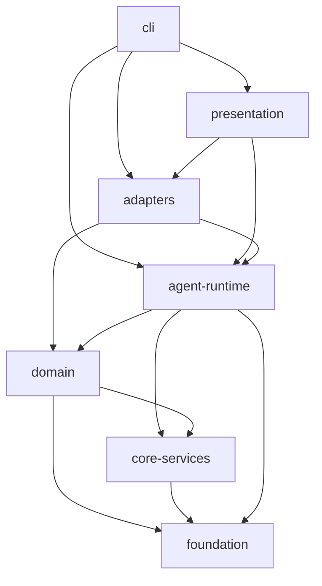

# 轻灵模块分层与包边界（Phase 4.4）

**日期**: 2026-07-10
**状态**: 现行结构的**目标分层 + 诚实债务清单**（尚未 monorepo 拆包）
**扫描**: `node scripts/dep-layers.mjs`（可选 `--json` / `--write-doc` / `--strict`）

---

## 1. 目标

在 **不立刻拆 npm 包** 的前提下，固定「依赖只能向下」的纪律，为将来可选的：

- `@qlingzzy/core`（foundation + core-services）
- `@qlingzzy/agent`（agent-runtime + domain 子集）
- `@qlingzzy/cli`（cli + presentation）

预留边界。当前仍是 monorepo 单包 `@qlingzzy/qling`。

---

## 2. 目标分层（自上而下）

| 层 | Rank | 职责 | 典型路径 |
|----|------|------|----------|
| **cli** | 6 | 进程入口、slash 命令、bootstrap | `index.ts`, `cli/`, `commands/` |
| **presentation** | 5 | 终端 UI | `tui/` |
| **adapters** | 4 | 对外报告、daemon、dashboard、SDK 胶水 | `*-report.ts`, `daemon.ts`, `sdk.ts`, `doctor.ts` |
| **agent-runtime** | 3 | Agent 循环、工具执行 | `agent-loop.ts`, `tools/`, `agent/`, `repl.ts` |
| **domain** | 2 | 会话/记忆/使命/MCP/通道/技能 | `session/`, `memory/`, `mission/`, `mcp/`, `channels/`, `skills/` |
| **core-services** | 1 | 管线、guard、LSP、压缩 | `pipeline/`, `guard/`, `lsp/`, `context-*.ts` |
| **foundation** | 0 | 类型、配置、路径、i18n、provider 表 | `types.ts`, `config.ts`, `runtime-paths.ts`, `utils/`, `i18n/`, `providers/` |

### 依赖规则

```
cli → presentation | adapters | agent-runtime | domain | core-services | foundation
presentation → adapters | agent-runtime | domain | foundation
adapters → agent-runtime | domain | core-services | foundation
agent-runtime → domain | core-services | foundation
domain → core-services | foundation
core-services → foundation
foundation → （无上层）
```

**禁止**：rank 更低的层 import rank 更高的层（例如 `foundation → cli`、`domain → agent-runtime`）。

---

## 3. 当前快照（扫描结果）

运行：

```bash
node scripts/dep-layers.mjs
```

近期一次扫描（约 177 个 `src/**/*.ts`；以 `npm run dep:layers` 为准）：

| 层 | 文件数（约） |
|----|-------------|
| cli | 48 |
| domain | 47 |
| adapters | 27 |
| agent-runtime | 22 |
| core-services | 14 |
| foundation | 10 |
| presentation | 9 |

快照：`docs/dependency-layers.snapshot.json`（`node scripts/dep-layers.mjs --write-doc`）。

主要**合法**跨层边（次数高）：

- `cli → adapters / domain / foundation`
- `agent-runtime → foundation / domain / core-services`
- `domain → foundation`
- `core-services → foundation`

### Mermaid（目标形状）



---

## 4. 已知反向依赖（技术债）

扫描会报告 `forbidden reverse edges`。常见模式与治理方向：

| 模式 | 示例 | 建议 |
|------|------|------|
| adapters → cli | `doctor.ts` / `*-report.ts` import `commands/runtime` | 将 `SlashCommandContext` 抽到 `foundation` 或 `adapters/types` |
| domain → agent-runtime | `eval/tasks.ts` import `tools/*` | 将 `eval/` 标为 adapters，或 eval 只测 foundation/domain 纯函数 |
| agent-runtime → cli | `repl.ts` import `commands/index` | 命令表注入，而非 runtime import commands |
| agent-runtime → adapters | `agent-loop` import `dashboard-server` | dashboard 改为事件订阅 / 懒加载注入 |
| core-services → domain | `pipeline/sections` import `skills/types` | `SkillMeta` 下沉 foundation |
| presentation → cli | tui import commands 建议 | 经 runtime 回调注入 |

**当前策略**：文档化 + `dep-layers.mjs` 可观测；**`--strict` 暂不进入 ci:check**（待债降到 0 再开）。

---

## 5. 公开 SDK 面（已存在）

`src/sdk.ts` 导出应保持**窄且稳定**：

- 允许：`AgentLoop`、config、provider/mcp presets、runtime-paths、部分工具注册
- 避免：直接导出整个 `commands/*`、`tui/*` 实现细节

演进时：SDK 只依赖 `agent-runtime` 及以下层。

---

## 6. 拆包预备（不实施）

| 未来包 | 约含层 | 说明 |
|--------|--------|------|
| `@qlingzzy/foundation` | foundation | 零业务副作用 |
| `@qlingzzy/core` | + core-services | guard/pipeline/lsp |
| `@qlingzzy/agent` | + domain + agent-runtime | 可嵌入 Agent |
| `@qlingzzy/cli` | + adapters + presentation + cli | bin: qling |

拆包门槛：`forbiddenCount === 0` 且 SDK 契约测试绿。

---

## 7. 操作命令

```bash
# 人类可读 + mermaid
node scripts/dep-layers.mjs

# JSON
node scripts/dep-layers.mjs --json

# 写入 docs/dependency-layers.snapshot.json
node scripts/dep-layers.mjs --write-doc

# 有反向依赖则失败（治理后期再用）
node scripts/dep-layers.mjs --strict
```

npm：

```bash
npm run dep:layers
```

---

## 8. 下一步治理顺序（建议）

1. ~~agent-loop 与 dashboard 解耦~~（2026-07-14：动态 import，静态边已断）
2. 抽出 `SlashCommandContext` → 切断 adapters→cli
3. `eval/` 改挂 adapters 或独立 `eval` 层
4. `SkillMeta` 下沉 foundation
5. 再考虑 monorepo workspaces

**已落地拆分（Phase 5.2）**：`providers/llm-client.ts`（foundation）、`memory/lifecycle.ts`（domain）。`forbiddenCount` 20→19。

---

## 9. 相关

- Phase 4 总路线：`docs/superpowers/specs/20260710-phase4-capability-roadmap-spec.md`
- 扫描脚本：`scripts/dep-layers.mjs`
- Phase 5.2 收口：`docs/superpowers/reviews/20260714-phase52-agent-loop-extract-closeout.md`
