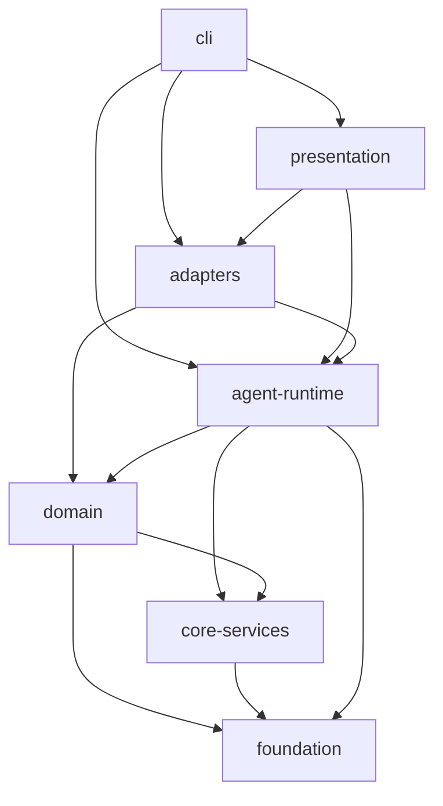

# 轻灵模块分层与包边界

**建立**: 2026-07-10 · **更新**: 2026-07-22（Qling 1.3.1）
**状态**: 单仓库单包 + **strict 门禁**（当前反向依赖 0）
**扫描**: `node scripts/dep-layers.mjs`（`--json` / `--write-doc` / `--strict` / `--baseline` / `--write-baseline`）

---

## 1. 目标

在 **不立刻拆 npm 包** 的前提下，固定「依赖只能向下」的纪律，为将来可选的：

- `@qlingzzy/core`（foundation + core-services）
- `@qlingzzy/agent`（agent-runtime + domain 子集）
- `@qlingzzy/cli`（cli + presentation）

预留边界。当前仍是单仓库单包 `@qlingzzy/qling`。

---

## 2. 目标分层（自上而下）

| 层 | Rank | 职责 | 典型路径 |
|----|------|------|----------|
| **cli** | 6 | 进程入口、slash 命令、bootstrap | `index.ts`, `cli/`, `commands/` |
| **presentation** | 5 | 终端 UI | `tui/` |
| **adapters** | 4 | 对外报告、daemon、dashboard、SDK 胶水 | `*-report.ts`, `daemon.ts`, `sdk.ts`, `doctor.ts` |
| **agent-runtime** | 3 | Agent 循环、工具执行 | `agent-loop.ts`, `tools/`, `agent/`, `repl.ts` |
| **domain** | 2 | 会话/记忆/使命/MCP/通道/技能 | `session/`, `memory/`, `mission/`, `mcp/`, `channels/`, `skills/` |
| **core-services** | 1 | 管线、guard、LSP、压缩 | `pipeline/`, `guard/`, `lsp/`, `context-*.ts` |
| **foundation** | 0 | 类型、配置、路径、i18n、provider 表 | `types.ts`, `config.ts`, `runtime-paths.ts`, `utils/`, `i18n/`, `providers/` |

### 依赖规则

```
cli → presentation | adapters | agent-runtime | domain | core-services | foundation
presentation → adapters | agent-runtime | domain | foundation
adapters → agent-runtime | domain | core-services | foundation
agent-runtime → domain | core-services | foundation
domain → core-services | foundation
core-services → foundation
foundation → （无上层）
```

**禁止**：rank 更低的层 import rank 更高的层（例如 `foundation → cli`、`domain → agent-runtime`）。

---

## 3. 当前快照（扫描结果）

运行：

```bash
node scripts/dep-layers.mjs
```

2026-07-22 扫描结果（247 个 `src/**/*.ts`；以本机重新运行结果为准）：

| 层 | 文件数 |
|---|---:|
| cli | 58 |
| domain | 57 |
| agent-runtime | 45 |
| adapters | 32 |
| presentation | 17 |
| core-services | 16 |
| foundation | 16 |
| other | 6 |

快照：`docs/dependency-layers.snapshot.json`（`node scripts/dep-layers.mjs --write-doc`）。

主要**合法**跨层边（次数高）：

- `cli → adapters / domain / foundation`
- `agent-runtime → foundation / domain / core-services`
- `domain → foundation`
- `core-services → foundation`

### Mermaid（目标形状）



---

## 4. 当前门禁状态

`node scripts/dep-layers.mjs --strict` 当前报告：

```text
forbidden reverse edges: 0
```

已完成的关键治理：

| 原问题 | 当前做法 |
|---|---|
| adapters → cli | `SlashCommandContext` 下沉，slash ports 通过注入安装 |
| core-services → domain | `SkillMeta`、Approval 类型下沉到 foundation |
| adapters → presentation | eval 不再静态依赖 TUI shell |
| agent-runtime / presentation → cli | 命令表和 UI 能力经 runtime 回调注入 |
| domain → agent-runtime | `DurableSessionSupervisor` 上提到 `src/agent/` |
| 全局服务串线风险 | Provider、Memory、MCP registry 与 dispatcher 绑定到 `RuntimeServices` 实例 |

**CI 策略**：

- `npm run dep:layers` + **`--strict`** 已进入 `ci:check`（当前 **0** 条反向边）
- 历史 baseline 文件可保留作审计参考：`docs/dependency-layers.baseline.json`
- slash 分发：cli 通过 `installSlashPorts` 注入；runtime/presentation 不静态 import `commands/*`
- `DurableSessionSupervisor` 已上提到 `src/agent/`（agent-runtime）

---

## 5. 公开 SDK 面（已存在）

`src/sdk.ts` 导出应保持**窄且稳定**：

- 允许：`AgentLoop`、config、provider/mcp presets、runtime-paths、部分工具注册
- 避免：直接导出整个 `commands/*`、`tui/*` 实现细节

演进时：SDK 只依赖 `agent-runtime` 及以下层。

---

## 6. 拆包预备（不实施）

| 未来包 | 约含层 | 说明 |
|--------|--------|------|
| `@qlingzzy/foundation` | foundation | 零业务副作用 |
| `@qlingzzy/core` | + core-services | guard/pipeline/lsp |
| `@qlingzzy/agent` | + domain + agent-runtime | 可嵌入 Agent |
| `@qlingzzy/cli` | + adapters + presentation + cli | bin: qling |

拆包门槛：`forbiddenCount === 0` 且 SDK 契约测试绿。

---

## 7. 操作命令

```bash
# 人类可读 + mermaid
node scripts/dep-layers.mjs

# JSON
node scripts/dep-layers.mjs --json

# 写入 docs/dependency-layers.snapshot.json
node scripts/dep-layers.mjs --write-doc

# 有反向依赖则失败
node scripts/dep-layers.mjs --strict
```

npm：

```bash
npm run dep:layers
```

---

## 8. 后续维护规则

1. 新文件必须先加入 `scripts/dep-layers.mjs` 的明确分类，避免长期落入 `other`。
2. 新增跨层 import 时先判断能否下沉类型、注入接口或移动职责，不直接扩大允许边。
3. `forbiddenCount` 必须保持为 0；baseline 只作历史审计，不用于掩盖新违规。
4. SDK 导出扩大前运行契约测试，避免把 CLI/TUI 实现细节提升为公共 API。
5. 只有出现独立发布、版本或依赖管理需求时才讨论拆包，不为目录美观引入 monorepo 复杂度。

---

## 9. 相关

- 历史 Phase 4 路线：`docs/superpowers/specs/20260710-phase4-capability-roadmap-spec.md`
- 扫描脚本：`scripts/dep-layers.mjs`
- Phase 5.2 收口：`docs/superpowers/reviews/20260714-phase52-agent-loop-extract-closeout.md`
