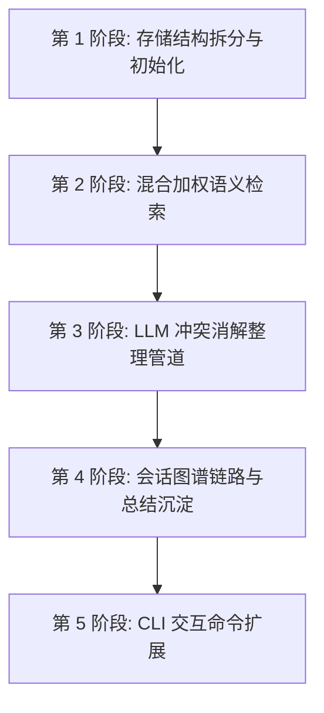

# 轻灵 TUI 跨会话记忆系统实施计划 (2026-06-15)

## 1. 实施步骤

本方案实施分为五个关键阶段，涵盖分域存储初始化、混合加权检索、LLM 冲突整理管道、会话知识图谱链接以及管理命令行扩展。

---

### 1.1 第 1 阶段：存储结构拆分与初始化
- **修改文件**：`src/memory.ts`
  - 修改 `MemoryStore` 类的构造函数，添加 `workspaceDir: string` 参数。
  - 在 `MemoryStore` 中实例化两个 `PersistedMemory` 实例：
    - `globalPersisted`：存放于 `path.join(runtimeRootDir, "memory", "global")`
    - `workspacePersisted`：存放于 `path.join(runtimeRootDir, "memory", "workspace", wsHash)`，其中 `wsHash` 为对 `workspaceDir` 的绝对路径计算 SHA-256 并截取前 16 位字符。
- **修改文件**：`src/agent-loop.ts`
  - 更新 `AgentLoop` 构造函数中 `this.memoryStore` 的实例化，传入 `this.config.runtime.workspaceDir`。

---

### 1.2 第 2 阶段：混合加权语义检索
- **修改文件**：`src/memory.ts` 的 `MemoryStore` 检索逻辑
  - 实现 `getRelevant(query, limit)` 的加权路由：
    - 同时向 `globalPersisted` 和 `workspacePersisted` 发起 `getRelevant(query, limit)` 请求。
    - 对全局记忆计算得出的相关度得分打 0.7 的折扣，对工作区项目记忆赋予 1.0 的满额权重。
    - 混合两组检索结果，按最终得分降序排序，去重后截取前 `limit` 个条目提供给大模型，保证项目背景记忆优先。

---

### 1.3 第 3 阶段：LLM 冲突消解整理管道
- **修改文件**：`src/memory/memory-llm-dream.ts` 或新设 `src/memory/consolidation.ts`
  - 编写 `consolidateMemories(conversation: ConversationTurn[], currentMemories: PersistedEntry[]): Promise<MemoryOperation[]>` 核心服务。
  - 设计 Prompt，提供当前对话上下文与已存在的事实，诱导大模型进行一致性审计并输出包含 `ADD`、`UPDATE`、`DELETE` 操作的 JSON。
  - **修改文件**：`src/memory.ts` 中 `MemoryStore` 类
    - 增加 `applyConsolidation(ops: MemoryOperation[])` 方法，用以执行相应的 `add`、`update` 和 `remove` 操作，并通过 `WAL` 异步保存到磁盘与 SQLite 数据库中。

---

### 1.4 第 4 阶段：会话图谱链路与总结沉淀
- **修改文件**：`src/memory/cognitive-index.ts`
  - 在 `CognitiveIndex` 中增加 `linkSessionToEntities(sessionId: string, summary: string, files: string[], tasks: string[])`。
  - 在 SQLite 的知识图谱节点和边表（`kg_nodes`, `kg_edges`）中持久化创建 `session` 节点，并建立 `executes`（任务）、`modifies`（文件）等边关系。
- **修改文件**：`src/agent-loop.ts`
  - 会话退出或持久化归档时，大模型先自动对该轮会话进行一句话摘要（Summary），然后调用上述图谱链接接口保存会话图谱关系。

---

### 1.5 第 5 阶段：CLI 交互命令扩展
- **修改文件**：`src/commands/memory.ts`
  - 扩展 `/memory` 命令的子命令分支，实现如下行为：
    - `/memory list [global|workspace]`：物理分类显示记忆条目。
    - `/memory add <fact> [--global]`：向指定层级添加事实条目。
    - `/memory delete <id>`：从本地移除条目。
    - `/memory edit <id> <new_content>`：修改现有条目事实。
    - `/memory graph [count]`：以可视化的文本缩进或 ASCII 网格展示 `Session -> Task -> File` 的关联链路。

---

## 2. 验证方案

### 2.1 单元测试验证
- **测试用例 1（分域隔离测试）**：
  - 分别在 `workspace-A` 与 `workspace-B` 下读写 `MemoryStore`，断言两个项目的 SQLite 与 `memory.json` 文件路径完全隔离独立，数据互不交叉。
- **测试用例 2（加权排序与冲突更新测试）**：
  - 注入重叠事实，触发 `consolidateMemories` 管道，检查大模型是否能输出 `UPDATE` 指令，并验证数据库中对应的旧记录是否被成功物理覆盖，而没有产生重复的向量条目。

### 2.2 冒烟与 CI 测试
- 运行 `npm run build`，确保没有 TypeScript 类型冲突。
- 运行 `npm run ci:check`，保证存量测试（特别是 `/dream`、`/distill`）完全兼容通过。
