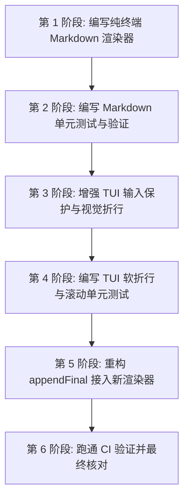

# 轻灵 TUI 多行输入与 Markdown 表格渲染增强实施计划 (2026-06-15)

## 1. 实施步骤

本轮重构及增强包含六个核心阶段，均在 `C:\Users\Lenovo\projects\qling` 下执行：

### 1.1 第 1 阶段：编写纯终端 Markdown 渲染器
- **新建文件**：`src/tui/markdown.ts`
- **主要实现**：
  - `parseMarkdownTable(lines: string[]): ParsedTable | null`：安全判断 GFM 格式表格，支持首尾带/不带 `|`，检查第二行是否是有效的 `| --- | --- |` 分隔线，不是则拒绝解析并返回 `null`。
  - `formatCell(cell: string, width: number): string`：对单元格内容按可视宽度对齐，并使用 `string-width` 精确度量，截断时末尾加 `…` 并补全空格，使得可视长度刚好等于 `width`。
  - `renderTable(table: ParsedTable, width: number): string[]`：自适应分配各列列宽，处理中文宽字符，渲染出带直角边框的完整对齐表格。
  - `formatMarkdownForTerminal(text: string, options: { width: number }): string[]`：将通用 Markdown（包含标题 `#`、列表 `-`/`*`/`\d.`、代码块、表格、普通文本以及内联粗体等）渲染为带 ANSI 颜色的终端输出物理行。

### 1.2 第 2 阶段：编写 Markdown 单元测试
- **新建文件**：`tests/unit/tui-markdown.test.mjs`
- **覆盖用例**：
  - 正常表格解析与自适应列宽分配，中文宽字符完全对齐不抖动。
  - 含有非表格包含 `|` 的日志/普通物理行的安全降级测试（返回原本字符，不触发表格渲染）。
  - 标题、有序/无序列表、代码块（带有边框）和内联粗体的渲染样式断言。
- **运行命令**：`node --test tests/unit/tui-markdown.test.mjs`

### 1.3 第 3 阶段：增强 TUI 输入保护与视觉折行
- **修改文件**：`src/tui/streaming-tui.ts`
- **动作**：
  - **非 bracketed 粘贴保护**：在 `dataHandler` 处理 chunk 时，如 chunk 包含 `\n` 或 `\r` 且不在 bracketedPaste 状态下，则将 chunk 内的物理换行替换为 `insertNewline()`，普通字符转为 `insertChar(ch)` 写入 `InputBuffer`，并调用 `redrawInput()` 重新显示，不触发 `handleEnter` 提交。
  - **视觉软折行**：实现 `wrapInputVisualLines(value: string, width: number, cursor: number): WrappedInput`。
  - **滚动视窗**：根据视觉行数自适应计算 `startRow`（最多显示 5 行），并在需要时动态重绘顶边框 `inputFrameTop()` 与底边框 `inputFrameBottom()`。
  - **多行草稿指示器**：在输入框正下方输出黄色提示 `多行草稿：Enter 发送全部内容`。

### 1.4 第 4 阶段：编写 TUI 软折行与滚动单元测试
- **修改文件**：`tests/unit/streaming-tui-ctrl-c.test.mjs`
- **动作**：
  - 增加对单个大 chunk 输入（非 bracketed paste 含有换行）不触发提交的粘贴保护断言。
  - 对超过 5 行的多行输入，断言其边框被正确加入了 `▲` 与 `▼` 指示符，且只渲染 5 行可视区域。
- **运行命令**：`node --test tests/unit/streaming-tui-ctrl-c.test.mjs`

### 1.5 第 5 阶段：重构 appendFinal 接入新渲染器
- **修改文件**：`src/tui/streaming-tui.ts`
- **动作**：重写 `appendFinal(text)`，直接利用 `formatMarkdownForTerminal` 进行渲染输出，删去原简陋且容易产生错位的 `parseTableLines` 与局部渲染逻辑。

### 1.6 第 6 阶段：全局 CI 检验与回归测试
- 运行 `npm run build`。
- 运行 `npm run ci:check`。
- 执行旧名扫描。
- 执行 `npm audit`。
- 确认全部测试绿色通过。

---

## 2. 验证与回归指标

1. **表格边框完整性**：无论单元格是中文、混合字符还是极长字符串，渲染的 Box table 各物理行的 `string-width` 应严格相等，边框不出现偏移、对齐线不错位。
2. **多行粘贴安全**：将一段 10 行的 markdown 代码直接粘贴到终端中，输入框能够完美支持软换行和滚动裁剪，且只算作 1 个草稿，按 Enter 后一次性发送，不再打碎为 10 个后台 Agent 队列任务。
3. **老测试不挂**：所有现有的 slash completion、Ctrl+C、Tab 导航等测试均无破损。
